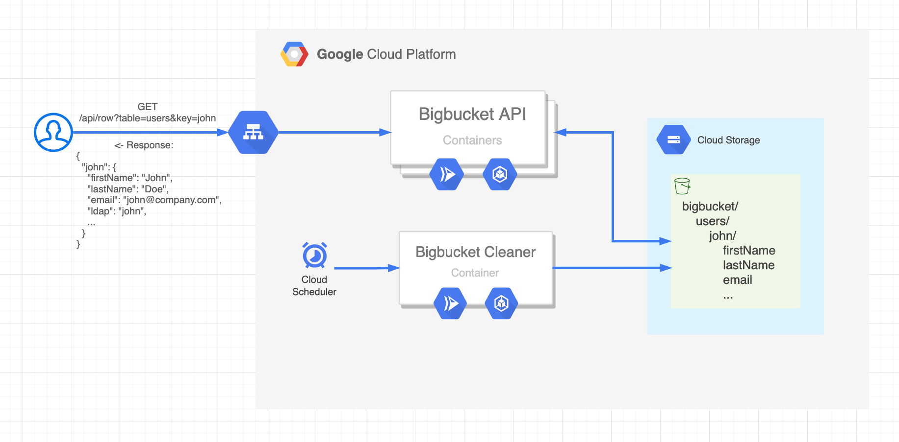
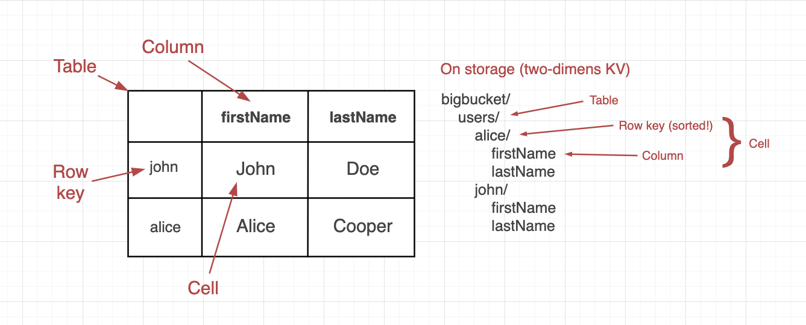

# Bigbucket


Bigbucket is a serverless NoSQL database with a focus on scalability, availability and simplicity. It has a Bigtable-style data model with storage backed by a Cloud Storage Bucket.

It's serverless in the sense of the storage layer being fully managed and the API layer being stateless and horizontally scalable, which makes it ideal to run in serverless offerings like Google Cloud Run/Functions or AWS Lambda. No servers/disks to manage, no masters/slaves, no sharding; just create a bucket and point a binary to it.

The goal of the project is to offer a simple, easy to manage wide column database, with a lower barrier to entry compared to Bigtable and Cassandra, to folks who care more about scalability and availability rather than maximum performance.

_Note_: The project is currently in alpha and under development. I would not recommend it for production usage just yet, but if you do try it, feedback would be highly appreciated :)

Features:

- Bigtable-style data model (wide column / two-dimensional KV)
- Storage backed by a Cloud Storage Bucket ([GCS](https://cloud.google.com/storage/) available, S3 planned)
- Fully stateless frontend with a simple RESTful API
- Horizontally scalable. Need more throughput? Just add more replicas and raise Cloud Storage quotas if necessary
- (WIP) Flexible data schema with the option to enforce at API layer
- (WIP) Authentication and access policies per operation, per table/column
- Async delete of tables and columns? Just run another instance in cleaner/garbage-collection mode
- Row operations(read/set/delete) are parallelized (e.g. 1 row read ~= 1k row read)
- Row cells compressed with [Zstandard](https://facebook.github.io/zstd/)
- Out of the box from Cloud Storage:
  - Strongly consistent writes
  - Highly available and replicated objects
  - Pay per request and per GB stored /month
  - Object versioning and lifecycle management
  - Auditing
  - Single region for lower latency or multi-region for more availability

Sections:

- [Architecture and data model](#architecture-and-data-model)
- [API](#api)
- [Clients](#clients)
- [Running](#running)
- [Configuration](#configuration)
- [Contributing](#contributing)
- [TODO / Ideas](#todo--ideas)

## Architecture and data model

Here's an overview diagram of how Bigbucket would look like deployed and serving requests on GCP. In this scenario:

- **Bigbucket API** allows clients to interact with the wide column store through a RESTful API, like listing/counting/reading/writing/deleting rows, and listing/deleting columns and tables. It's deployed as an auto-scaling private Cloud Run service, with appropriate bucket permissions. Client requests will be load balanced between the containers and authenticated using their service account identity token ([GCP docs](https://cloud.google.com/run/docs/authenticating/developers)).

- **Bigbucket Cleaner** removes tables and columns that have been marked for deletion. It's deployed as a single-container private Cloud Run service, with appropriate bucket permissions, triggered every hour by a Cloud Scheduler job.

To run this yourself, check out the [Running in Cloud](#running-in-cloud) section.



Also here's a visual representation of the data model and the terminology behind it. Compared to Bigtable, the current model has 2 key differences:

1. There are no column families, just columns, mainly for the sake of simplicity and because object partitioning is fully managed by the bucket. Column prefix filtering, in adition to the current specific column filtering, can be added later if there's a need for it.

2. The initial version of the API only allows fetching of the latest cell version, but there's a plan to allow listing/reading previous cell values leveraging the object versioning feature of the bucket. This allows users to have full control over the max number of versions allowed or specify an expiry/delete lifecycle, using cloud provider tools already available and understood.



A few things to keep in mind when designing your schema are:

- Row keys are sorted and they are the only way to filter your rows. The value of cells cannot be queried, only returned. Design your row keys with your queries in mind, with the more important values first, taking into account key prefixes as that is currently the only way to scan the table. The [Cloud Bigtable guide to choosing row keys](https://cloud.google.com/bigtable/docs/schema-design#row-keys) is a good resource here.
- Reading a single row with a specified key and columns is the fastest way to get a cell value. Using row key prefixes or not specifying which columns you want will require additional requests to the bucket.
- The cells are compressed with [Zstandard](https://facebook.github.io/zstd/), so no need to pre-compress yourself.
- It's cheaper and faster to fetch 10 big columns rather than 100 small columns. Try to combine similarly read data together in the same column.
- Write-heavy data should be kept in separate columns as there is an update limit of once per second for the same cell ([GCS quotas](https://cloud.google.com/storage/quotas#objects)).

## API

_Note on naming_: Tables, columns and row keys follow [object name requirements from Google Cloud Storage](https://cloud.google.com/storage/docs/naming-objects). In short, Bigbucket API will return "HTTP 400 Bad Request" when trying to use tables, columns or row keys starting with dot "." or containing: \n, \r, \t, \b, #, [, ], *, ?, /

### Table

```
Endpoint: /api/table
```

#### Create tables

Schema is flexible by default so tables are automatically created when a new row is inserted. Schema enforcement is planned for the near future.

#### List tables

```
curl -X GET "http://localhost:8080/api/table"

Response:
{
  "tables": [
    "test"
  ]
}
```

#### Delete table

Tables marked for deletion will need to be garbage-collected by running Bigbucket in cleaner mode. See [Running](#running) section below.

```
Querystring parameters:

  table (required)
```

```
curl -X DELETE "http://localhost:8080/api/table?table=test"

Response:
{
  "success": "Table 'test' marked for deletion"
}
```

### Column

```
Endpoint: /api/column
```

#### Create columns

Schema is flexible by default so columns are automatically created when rows are inserted. Schema enforcement is planned for the near future.

#### List columns

Because of schema flexibility, this will list the columns from only the first row in your table.

```
Querystring parameters:

  table (required)
```

```
curl -X GET "http://localhost:8080/api/column?table=test"

Response:
{
  "columns": [
    "col1",
    "col2",
    "col3"
  ],
  "table": "test"
}
```

#### Delete column

Columns marked for deletion will need to be garbage-collected by running Bigbucket in cleaner mode. See [Running](#running) section below.

```
Querystring parameters:

  table  (required)
  column (required)
```

```
curl -X DELETE "http://localhost:8080/api/column?table=test&column=col1"

Response:
{
  "success": "Column 'col1' marked for deletion in table 'test'"
}
```

### Row

```
Endpoint: /api/row
```

#### Count rows

```
Querystring parameters:

  table  (required)

  prefix (optional) // Row key prefix
```

```
curl -X GET "http://localhost:8080/api/row/count?table=test"

Response:
{
  "rowsCount": "5",
  "table": "test"
}
```

#### List row keys

```
Querystring parameters:

  table  (required)

  prefix (optional) // Row key prefix
```

```
curl -X GET "http://localhost:8080/api/row/list?table=test"

Response:
{
  "rowKeys": ["key1", "key2", "key3", "key4", "key5"],
  "table": "test"
}
```

#### Read rows

```
Querystring parameters:

  table   (required)

  columns (optional) // Comma separated
  limit   (optional) // Limit of rows returned

  Exclusive (only one of):

  key     (required) // Row key
  prefix  (required) // Row key prefix
```

Read single row with specified columns (fastest read op):

```
curl -X GET "http://localhost:8080/api/row?table=test&key=key1&columns=col1,col2,col3"

Response:
{
  "key1": {
    "col1": "val",
    "col2": "val",
    "col3": "val"
  }
}
```

Read all rows:

```
curl -X GET "http://localhost:8080/api/row?table=test"

Response:
{
  "key1": {
    "col1": "val",
    "col2": "val",
    "col3": "val"
  },
  "key2": {
    "col1": "val",
    "col2": "val",
    "col3": "val"
  },
  ...
}
```

Read rows with prefix and limit:

```
curl -X GET "http://localhost:8080/api/row?table=test&prefix=key&limit=1"

Response:
{
  "key1": {
    "col1": "val",
    "col2": "val",
    "col3": "val"
  }
}
```

#### Set row

```
Querystring parameters:

  table   (required)
  key     (required) // Row key

JSON Payload:

  {
    column (string): value (string),
  }
```

```
curl -X POST "http://localhost:8080/api/row?table=test&key=key5" \
  -d '{"col1": "newVal", "col3": "newVal"}'

Response:
{
  "success": "Set row key 'key5' in table 'test'"
}
```

#### Delete rows

```
Querystring parameters:

  table   (required)

  Exclusive (only one of):

  key     (required) // Row key
  prefix  (required) // Row key prefix
```

Delete one row:

```
curl -X DELETE "http://localhost:8080/api/row?table=test&key=key5"

Response:
{
  "success": "Row with key 'key5' was deleted from table 'test'"
}
```

Delete rows with prefix:

```
curl -X DELETE "http://localhost:8080/api/row?table=test&prefix=key"

Response:
{
  "success": "4 rows with key prefix 'key' were deleted from table 'test'"
}
```

## Clients

- [Python3](https://github.com/adrianchifor/bigbucket-python)

## Running

Create a [GCS bucket](https://cloud.google.com/storage/docs/creating-buckets#storage-create-bucket-gsutil)

```
gsutil mb -p <your-project> -l EUROPE-WEST1 gs://<bucket-name>/
```

### Running locally

#### Binary

```
git clone https://github.com/adrianchifor/Bigbucket
cd Bigbucket
make
```

API

```
./bin/bigbucket --bucket gs://<bucket-name>
```

Cleaner

```
./bin/bigbucket --bucket gs://<bucket-name> --cleaner --cleaner-interval 30
```

#### Docker

API

```
docker run -d --name "bigbucket-api" \
  -e BUCKET=gs://<bucket-name> \
  -v ${HOME}/.config/gcloud:/root/.config/gcloud \
  -p 8080:8080 \
  adrianchifor/bigbucket:latest
```

Cleaner

```
docker run -d --name "bigbucket-cleaner" \
  -e BUCKET=gs://<bucket-name> \
  -e CLEANER=true \
  -e CLEANER_INTERVAL=30 \
  -v ${HOME}/.config/gcloud:/root/.config/gcloud \
  adrianchifor/bigbucket:latest
```

We mount `${HOME}/.config/gcloud:/root/.config/gcloud` in both cases so the containers can use our local gcloud credentials to talk to the bucket.

Let's test it

```
# Set a row
$ curl -X POST "http://localhost:8080/api/row?table=test&key=key1" \
  -d '{"foo": "hello", "bar": "world"}' | jq .

{
  "success": "Set row key 'key1' in table 'test'"
}

# Get the row
$ curl -X GET "http://localhost:8080/api/row?table=test&key=key1" | jq .

{
  "key1": {
    "bar": "world",
    "foo": "hello"
  }
}

# Delete the table
$ curl -X DELETE "http://localhost:8080/api/table?table=test" | jq .

{
  "success": "Table 'test' marked for deletion"
}

# Check cleaner for garbage-collection
$ docker logs bigbucket-cleaner

2020/05/04 19:10:34 Running cleaner...
2020/05/04 19:10:35 Running cleaner every 30 seconds...
2020/05/04 19:18:36 Table 'test' cleaned up

# Stop containers
$ docker kill bigbucket-api
$ docker kill bigbucket-cleaner
```

### Running in Cloud

There's an example [run.yaml](./run.yaml) file on how to deploy Bigbucket to GCP, like in the first diagram in [Architecture and data model](#architecture-and-data-model), using [run-marathon](https://github.com/adrianchifor/run-marathon).

Modify `run.yaml` to suit your environment

```
git clone https://github.com/adrianchifor/Bigbucket
cd Bigbucket
vim run.yaml
```

Replace all occurances of `your_*` with your own project, region, bucket etc.

Let's deploy it

```
# Install run-marathon
$ pip3 install --user run-marathon

$ run check
Cloud Run, Build, Container Registry, PubSub and Scheduler APIs are enabled. All good!

# Build and push Docker image to GCR
$ run build
...

# Create service accounts, attach IAM roles, deploy to Cloud Run and create Cloud Scheduler job
$ run deploy
...

# Get the endpoint of your API
$ run ls
   SERVICE        REGION        URL                        LAST DEPLOYED BY   LAST DEPLOYED AT
✔  bigbucket-api  europe-west1  https://YOUR_API_ENDPOINT  you                some time
```

Let's test it

```
# Use your account identity token to authenticate to the private API endpoint
$ alias gcurl='curl --header "Authorization: Bearer $(gcloud auth print-identity-token)"'

# Set a row
$ gcurl -X POST "https://YOUR_API_ENDPOINT/api/row?table=test&key=key1" \
  -d '{"foo": "hello", "bar": "world"}' | jq .

{
  "success": "Set row key 'key1' in table 'test'"
}

# Get the row
$ gcurl -X GET "https://YOUR_API_ENDPOINT/api/row?table=test&key=key1" | jq .

{
  "key1": {
    "bar": "world",
    "foo": "hello"
  }
}
```

Nice! Now you've got load balanced, auto-scaling private Bigbucket API containers with TLS, and a Bigbucket Cleaner container triggered every hour.

## Configuration

### Flags

```
$ ./bin/bigbucket --help
Usage of ./bin/bigbucket:
  -bucket string
        Bucket name (required, e.g. gs://<bucket-name>)
  -cleaner
        Run Bigbucket in cleaner mode (default false). Will garbage collect tables and columns marked for deletion. Executes based on --cleaner-interval
  -cleaner-http
        Run Bigbucket in cleaner HTTP mode (default false). Executes on HTTP POST to /; to be used with https://cloud.google.com/scheduler/docs/creating
  -cleaner-interval int
        Bigbucket cleaner interval (default 0, runs only once). To run cleaner every hour, you can set --cleaner-interval 3600
  -port int
        Server port (default 8080)
  -version
        Version
```

### Environment variables

If the flags are not set, Bigbucket will look for the equivalent env vars:

```
--bucket           -> BUCKET
--cleaner          -> CLEANER
--cleaner-http     -> CLEANER_HTTP
--cleaner-interval -> CLEANER_INTERVAL
--port             -> PORT
```

## Contributing

Requirements: Go 1.14, gcloud/gsutil setup (for GCS usage)

### Project structure

```
api/
  column*      - listing/deleting columns
  table*       - listing/deleting tables
  row*         - counting/listing/reading/writing/deleting rows
  params.go    - HTTP parameter handling and validation
  server.go    - HTTP server and router

store/
  gcs*         - interact with Google Cloud Storage buckets and objects

tests/
  cleaner*     - tests for cleaner/garbage-collection functionality
  column*      - tests for column ops
  row*         - tests for row ops
  table*       - tests for table ops
  run_tests.sh - helper script to prepare env and run tests suite

utils/
  functions.go - generic utility funcs
  server.go    - HTTP server contructor and handlers (used in api and worker)
  state.go     - funcs to manage deleted tables/columns state

worker/
  cleaner.go   - runner (periodic/HTTP) and funcs for cleaning/GC of deleted tables/columns

go.mod         - Go version and dependencies
main.go        - entrypoint, handles flags/envs, bucket init and running the API or Cleaner
```

### Building and running

```
$ make
go fmt
go mod download
go build -o bin/bigbucket

$ ./bin/bigbucket --bucket gs://<your-bucket>
[GIN-debug] [WARNING] Creating an Engine instance with the Logger and Recovery middleware already attached.

[GIN-debug] [WARNING] Running in "debug" mode. Switch to "release" mode in production.
 - using env:   export GIN_MODE=release
 - using code:  gin.SetMode(gin.ReleaseMode)

[GIN-debug] GET    /api/table                --> bigbucket/api.listTables (3 handlers)
[GIN-debug] DELETE /api/table                --> bigbucket/api.deleteTable (3 handlers)
[GIN-debug] GET    /api/column               --> bigbucket/api.listColumns (3 handlers)
[GIN-debug] DELETE /api/column               --> bigbucket/api.deleteColumn (3 handlers)
[GIN-debug] GET    /api/row                  --> bigbucket/api.getRows (3 handlers)
[GIN-debug] GET    /api/row/count            --> bigbucket/api.getRowsCount (3 handlers)
[GIN-debug] POST   /api/row                  --> bigbucket/api.setRow (3 handlers)
[GIN-debug] DELETE /api/row                  --> bigbucket/api.deleteRows (3 handlers)
[GIN-debug] GET    /health                   --> bigbucket/api.RunServer.func1 (3 handlers)
2020/05/03 18:34:49 HTTP server is ready to handle requests at 127.0.0.1:8080
```

### Tests

Setup an empty bucket in GCS for testing. Make sure gcloud/gsutil is setup/authenticated locally.

Running the tests suite:

```
$ make test bucket=gs://<your-test-bucket>
go fmt
go mod download
go build -o bin/bigbucket
tests/run_tests.sh gs://<your-test-bucket>

Running bigbucket server

Running row tests
ok      command-line-arguments  2.158s

Running column tests
ok      command-line-arguments  0.212s

Running table tests
ok      command-line-arguments  0.093s

Running bigbucket cleaner

Running bigbucket cleaner tests
ok      command-line-arguments  6.447s

Killing bigbucket cleaner

Running bigbucket cleaner as HTTP server

Running HTTP cleaner tests
ok      command-line-arguments  0.587s

Cleaning up test bucket
Cleaning up bigbucket processes
Done
```

## TODO / Ideas

- Schema enforcement at API layer
- Authentication and access policies
- Multiple cell versions (via bucket object versions)
- Support file/blob uploads as cell values
- OpenAPI file for automatic client generation
- Caching at API layer of "GET api/row" request->results pairs (maybe with max memory and/or time)
- Start/End/Regex row key scanning (in addition to Prefix)
- Prometheus metrics
- AWS S3 backend
- Row key/column object triggers (for Pub/Sub). Might be useful for ETL, work queues
